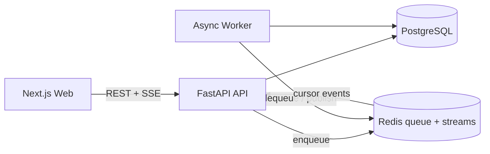

# Phase 1 实施记录

> 日期：2026-08-04
> 状态：首个可运行纵向切片已实现，Phase 1 尚未关闭

## 1. 本轮目标

本轮不是把旧脚本套进一个 Web 页面，而是先建立后续 Agent、RAG、评测和生产治理都能依附的工程主干。V1 作为对照基线保留，新代码位于独立包中，避免重写期间失去可运行参照物。

API 只负责鉴权边界预留、数据写入、任务入队和事件转发；生成工作不占用 API 请求进程。会话和 run 状态进入 PostgreSQL，流式事件进入 Redis Stream，因此后续可以增加 API/Worker 副本而不依赖单进程内存。

## 2. 已落地能力

### 后端

- `POST /api/v1/conversations`：创建对话；
- `GET /api/v1/conversations`：按更新时间获取历史；
- `GET /api/v1/conversations/{id}`：恢复消息；
- `PATCH /api/v1/conversations/{id}`：重命名；
- `DELETE /api/v1/conversations/{id}`：软删除；
- `POST /api/v1/conversations/{id}/messages`：持久化用户消息并创建 run；
- `GET /api/v1/runs/{id}/events`：SSE 事件流，支持 `Last-Event-ID`；
- `POST /api/v1/runs/{id}/cancel`：持久化取消状态并向 Worker 传播；
- `/health/live` 与 `/health/ready`：区分进程存活和依赖就绪。

事件契约目前包括 `run.status`、`message.delta`、`message.completed`、`run.failed`、`run.cancelled` 和 `heartbeat`。Redis Stream 保留游标与短期事件，反向代理可通过 `X-Accel-Buffering: no` 禁止缓冲。

### 前端

界面采用克制的对话产品布局：桌面端可折叠历史侧栏、移动端抽屉、居中消息列和底部输入框。已实现历史搜索、对话切换、行内重命名、删除确认、建议问题、Enter 发送、Shift + Enter 换行、流式增量、停止生成、错误态、骨架屏和系统主题跟随。

色彩只保留中性色和一个翡翠绿强调色。控件基于 Radix Themes，图标统一来自 Phosphor，减少自制交互组件带来的无障碍和一致性风险。

### 工程与部署

- `pyproject.toml` 管理后端运行与开发依赖；
- Alembic 管理 `conversations`、`messages`、`agent_runs`；
- API 与 Worker 使用同一非 root Python 镜像；
- Web 使用 Next.js standalone 输出和非 root Node 运行用户；
- Compose 用健康检查和一次性迁移服务控制启动顺序；
- CI 拆为仓库边界、后端、真实依赖集成、前端和 Compose 五个门禁。

## 3. 当前诚实边界

Worker 返回的是明确标记的 Phase 1 链路验证文本。LangGraph、Hybrid Retrieval、Reranker、引用核验、知识发布和千问模型调用尚未接入，因此不能用当前界面回答真实校务问题。

普通邮箱/用户名账号是已确认需求，但本纵向切片仍采用开发期匿名会话。账号表、密码哈希、登录会话、会话归属和速率限制将在 Phase 1 的下一批提交中完成，之后才允许公网试用。

刷新页面可以恢复已经持久化的历史；浏览器刷新后自动寻找未结束 run 并从游标续接仍待实现。这个缺口未关闭前，不宣称 Phase 1 门禁全部通过。

## 4. 下一批 Phase 1 任务

1. 普通账号注册、登录、退出和安全会话 Cookie；
2. 会话所有权隔离、用户级/IP 级限流和基础审计日志；
3. 活跃 run 查询与刷新续流；
4. API 错误码、幂等键、队列写入失败补偿和 Worker 优雅停机；
5. Nginx/Caddy 反向代理、TLS、部署环境 Secret 和阿里云启动脚本；
6. 在 ECS 上完成多副本验证、故障恢复演练与首轮 k6 smoke。

完成这些任务并保存 CI、演示录屏和测试证据后，才能关闭 Phase 1 并进入知识平台与 Hybrid RAG。
