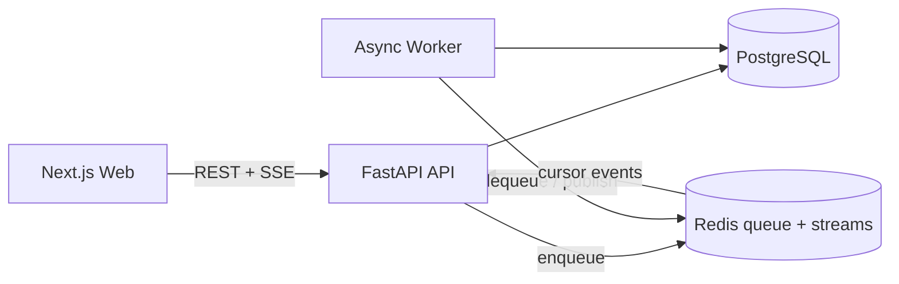

# Phase 1 实施记录

> 日期：2026-08-05
> 状态：代码与远端 CI 门禁已通过，等待杭州 ECS 预生产验收、恢复演练与压测后关闭

## 1. 本轮目标

本轮不是把旧脚本套进一个 Web 页面，而是先建立后续 Agent、RAG、评测和生产治理都能依附的工程主干。V1 作为对照基线保留，新代码位于独立包中，避免重写期间失去可运行参照物。

API 只负责认证与资源归属、数据写入、任务入队和事件转发；生成工作不占用 API 请求进程。账户、哈希会话、审计、对话和 run 状态进入 PostgreSQL，限流、任务队列和流式事件进入 Redis，因此后续可以增加 API/Worker 副本而不依赖单进程内存。

## 2. 已落地能力

### 后端

- `POST /api/v1/auth/register|login|logout` 与 `GET /api/v1/auth/me`；
- Argon2 密码哈希、HttpOnly/SameSite 会话 Cookie，数据库只保存令牌哈希；
- 用户级资源过滤，其他账户访问对话或 run 时统一返回 404；
- Redis Lua 原子登录/提问限流、审计事件和 HMAC 客户端指纹；
- 消息幂等键、并发 Worker 原子领取、队列失败状态补偿；
- `POST /api/v1/conversations`：创建对话；
- `GET /api/v1/conversations`：按更新时间获取历史；
- `GET /api/v1/conversations/{id}`：恢复消息；
- `PATCH /api/v1/conversations/{id}`：重命名；
- `DELETE /api/v1/conversations/{id}`：软删除；
- `POST /api/v1/conversations/{id}/messages`：持久化用户消息并创建 run；
- `GET /api/v1/runs/{id}/events`：SSE 事件流，支持 `Last-Event-ID`；
- `POST /api/v1/runs/{id}/cancel`：持久化取消状态并向 Worker 传播；
- `/health/live` 与 `/health/ready`：区分进程存活和依赖就绪。

事件契约目前包括 `run.status`、`message.delta`、`message.completed`、`run.failed`、`run.cancelled` 和 `heartbeat`。Redis Stream 保留游标与短期事件，反向代理可通过 `X-Accel-Buffering: no` 禁止缓冲。

### 前端

界面采用克制的对话产品布局：账户入口、桌面端可折叠历史侧栏、移动端抽屉、居中消息列和底部输入框。已实现注册登录、会话恢复、历史搜索、对话切换、行内重命名、删除确认、建议问题、Enter 发送、Shift + Enter 换行、流式增量、刷新续接、停止生成、错误态、骨架屏和系统主题跟随。

色彩只保留中性色和一个翡翠绿强调色。控件基于 Radix Themes，图标统一来自 Phosphor，减少自制交互组件带来的无障碍和一致性风险。

### 工程与部署

- `pyproject.toml` 管理后端运行与开发依赖；
- Alembic 管理 `conversations`、`messages`、`agent_runs`；
- API 与 Worker 使用同一非 root Python 镜像；
- Web 使用 Next.js standalone 输出和非 root Node 运行用户；
- Compose 用健康检查和一次性迁移服务控制启动顺序；
- Caddy 提供同源反向代理、自动 TLS、安全响应头和 SSE 非缓冲转发；
- 生产环境模板强制安全 Cookie 和独立审计密钥，ECS 脚本先校验再发布；
- CI 拆为仓库边界、后端、真实依赖集成、前端和 Compose 五个门禁。

## 3. 当前诚实边界

Worker 返回的是明确标记的 Phase 1 链路验证文本。LangGraph、Hybrid Retrieval、Reranker、引用核验、知识发布和千问模型调用尚未接入，因此不能用当前界面回答真实校务问题。

Agent、RAG 和千问调用仍未接入，Worker 继续返回明确标记的工程验证文本。当前代码具备公网部署边界，但尚未在 ECS 保存真实部署、故障演练和压力测试证据，因此本记录不宣称 Phase 1 已全部关闭。

## 4. 下一批 Phase 1 任务

1. ~~通过 GitHub CI 的后端、集成、前端和 Compose 全部门禁；~~ 已于 2026-08-05 通过；
2. 按 [`ECS_STAGING_DEPLOYMENT.md`](ECS_STAGING_DEPLOYMENT.md) 在杭州免费 ECS 上执行受限 IP 预生产部署和浏览器验收；正式 TLS 验收留待具备域名与合规部署环境后执行；
3. 验证双 API/双 Worker、Worker 中断恢复和数据库备份恢复；
4. 执行约 10–20 在线用户的 k6 smoke/soak，并保存延迟、错误率和资源曲线；
5. 冻结 Phase 1 演示版本，进入 Agent 编排与 Hybrid RAG 的 Phase 2。

完成这些任务并保存 CI、演示录屏和测试证据后，才能关闭 Phase 1 并进入知识平台与 Hybrid RAG。
