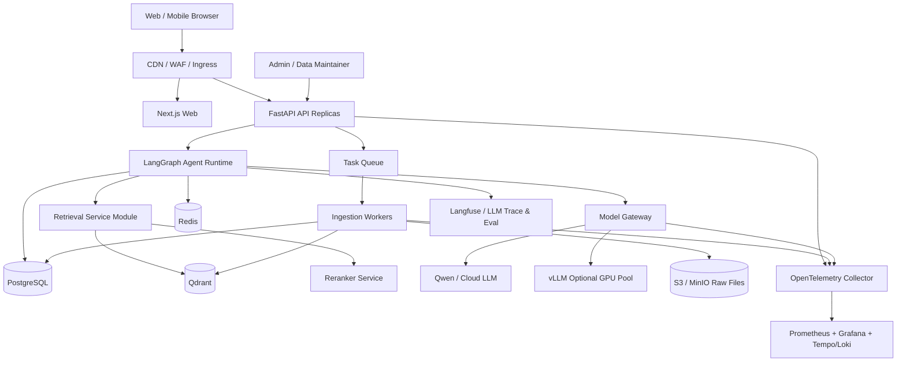
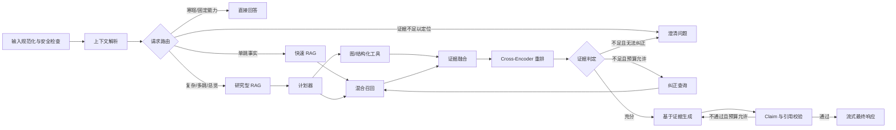
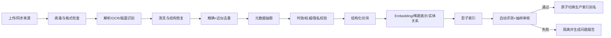

# PAIMON 工程化重做方案 V1

> 状态：初版评审稿
> 日期：2026-08-04
> 范围：架构重做方案，不代表现有业务代码已经迁移
> 核心目标：把 PAIMON 从“本地 RAG 演示”升级为可持续维护、可量化评估、可水平扩展、可真实服务南京大学新生的生产级智能助手。

## 1. 执行摘要

本次不建议继续围绕 `paimon_next/api.py` 和本地 JSON 索引做增量堆叠，而应采用“保留现有系统作为基线，新建 V2 主干，分阶段迁移”的方式重做。

V2 的核心不是简单换一个 Agent 框架或向量数据库，而是同时重建六条能力链：

1. **Agent 运行时**：用有状态、可恢复、可观测的 LangGraph 工作流代替手写顺序调用。
2. **检索生成**：升级为自适应 Agentic RAG，组合稀疏检索、稠密检索、重排、结构化过滤、时效性治理和受控纠错。
3. **服务工程**：异步 API、持久会话、限流与背压、任务队列、分布式缓存、容器化和弹性伸缩。
4. **效果工程**：建设版本化黄金测试集，分别测检索、回答、引用、Agent 决策、安全性、性能和成本。
5. **产品前端**：实现类似 ChatGPT 交互范式的完整会话产品，而不只是单页输入框。
6. **知识治理**：从“目录里放文件”升级为带来源、版本、有效期、权威度、受众和发布状态的数据资产。

建议采用 **模块化单体 API + 独立摄取 Worker + 独立模型服务** 的起步架构。它已经能够水平扩展，又比过早拆分十几个微服务更容易交付和排障。

---

## 2. 当前基线与主要问题

### 2.1 已有能力

当前项目并非完全没有高级检索，已经具备：

- BM25 与字符 n-gram 混合召回；
- RRF、多查询扩展和基于领域规则的重排；
- CRAG/Self-RAG 风格的证据质量判断；
- 轻量 GraphRAG；
- 引用、置信度、过期资料提醒；
- CLI、HTTP、SSE 和无外部 LLM 时的抽取式降级；
- 少量 smoke/regression 评测。

因此，V2 不应把这些已有能力重新包装后宣称创新，而应把它们转换为可训练、可评测、可扩展、可运营的正式系统。

### 2.2 审计数据

截至本方案编写时：

- `Documents/`、`QQ/`、`data/` 共包含约 468 个数据文件；
- 主要文件类型为 333 个 TXT、117 个 PDF、15 个 QA、2 个 Markdown 和 1 个 DOCX；
- 文件名中显式带 2010—2026 年或年级信息的资料至少 55 份；
- `.paimon_index/index.json` 约 44.5 MB，`graph.json` 约 50.2 MB；
- 当前索引约 26,132 个知识块，其中约 21,858 个普通文档块、3,754 个 PDF 块、475 个 QA 块、45 个目录概览块；
- 自动化评测只有 14 条 regression 和 3 条 smoke 样例；
- `paimon_next/api.py` 超过 3,000 行，并内嵌多个版本的 HTML/CSS/JavaScript；
- 服务使用 `ThreadingHTTPServer`，会话历史保存在进程内存，无法可靠水平扩展。

### 2.3 根因

| 领域 | 当前问题 | 生产后果 |
|---|---|---|
| Agent | 流程写死在 Service 方法中 | 无法恢复中断、难以观察每一步、无法稳定扩展工具 |
| RAG | 主要是进程内稀疏检索和规则评分 | 语义召回、结构过滤、跨文档推理与大规模检索受限 |
| GraphRAG | 图主要由词项共现和目录关系生成 | 容易“看起来有图”，但不一定带来可证明的多跳收益 |
| 状态 | 会话和历史位于进程内存 | 多副本之间不一致，重启即丢失 |
| API | 标准库 HTTP Server | 异步 I/O、鉴权、限流、OpenAPI、中间件能力不足 |
| 前端 | 页面嵌入 Python 字符串 | 无法独立测试、迭代、构建和部署 |
| 知识库 | 文件缺乏统一元数据和生命周期 | 旧通知、重复资料、个人观点与官方政策可能混用 |
| 评测 | 仅 17 条样例 | 无法证明效果、无法建立发布门禁 |
| 运维 | 缺少统一追踪、指标、告警和压测 | 出现慢请求或错误时难以定位根因 |

---

## 3. 目标、边界和成功标准

### 3.1 产品定位

PAIMON V2 是“有证据边界的南京大学新生事务助手”，重点覆盖报到、身份认证、校园卡、宿舍、医保、校园网、选课、专业分流、交通与校园生活。

它不是无限自主的通用 Agent，也不应在缺少学校资料时自由编造。创新必须服务于以下业务结果：

- 更高的正确率和召回率；
- 能识别政策时效和适用人群；
- 每个关键结论可追溯到来源；
- 证据不足时能澄清或拒答；
- 新生集中访问时仍稳定响应；
- 每次模型、索引、提示词和知识变更都能量化回归。

### 3.2 初版容量模型

在没有真实流量数据前，V1 方案先按以下低成本展示/试运行容量设计，后续根据监控数据调整：

- 约 100 名注册用户；
- 峰值 10—20 个在线会话；
- 常规峰值 1 个新问题/秒，允许短时突发到 2 个/秒；
- 最多 5—10 条同时进行的生成流；
- 预计每月 2,000—10,000 个问题；
- 高频 FAQ 允许命中语义缓存；
- 单个用户默认 10 次请求/分钟，可按可信身份提升额度。

### 3.3 首版 SLO 建议

| 指标 | 目标 |
|---|---:|
| API 可用性 | 月度不低于 99.9% |
| 非生成 API p95 | 小于 200 ms |
| 检索阶段 p95 | 小于 500 ms |
| 首 Token 时间 p95 | 小于 2.5 s，需单独标注外部模型耗时 |
| 流式请求错误率 | 小于 1% |
| 检索 Recall@5 | 黄金集不低于 0.85 |
| 引用正确率 | 不低于 0.95 |
| 有答案问题的事实正确率 | 不低于 0.85 |
| 无答案/过期问题的安全拒答 F1 | 不低于 0.85 |

这些是项目门禁，不是未经压测即可对外承诺的数据。

---

## 4. 目标架构



### 4.1 技术选型

| 层 | 首选 | 选择理由 |
|---|---|---|
| Web | Next.js + TypeScript + Tailwind CSS | 适合会话型产品、SSR/静态资源、前端工程化和流式 UI |
| API | FastAPI + Uvicorn | 异步 I/O、类型校验、OpenAPI、中间件生态成熟 |
| Agent | LangGraph | 状态图、持久化检查点、流式事件、人工介入和故障恢复 |
| 关系数据 | PostgreSQL | 用户、会话、消息、文档元数据、评测和审计记录 |
| 向量检索 | Qdrant | 稠密/稀疏/多阶段查询、payload 过滤和分布式部署 |
| 缓存/协调 | Redis | 限流、分布式信号量、短期缓存、SSE 状态和任务中间件 |
| 对象存储 | S3 兼容存储/MinIO | 原始文档和解析产物不应塞入 Git 或数据库大字段 |
| 异步任务 | Celery + Redis，后续可换专用 broker | 文档解析、OCR、Embedding、索引发布和离线评测 |
| 模型接入 | 内部 Model Gateway + OpenAI-compatible 接口 | 云端 Qwen 与自部署模型可替换，统一超时、重试和成本记录 |
| 自部署推理 | vLLM | OpenAI-compatible 服务和高吞吐批处理；只在确有 GPU 时启用 |
| 观测 | OpenTelemetry + Prometheus/Grafana + Tempo/Loki | 统一 traces、metrics、logs，避免供应商锁定 |
| LLM 观测 | Langfuse 自托管或等价平台 | Prompt、Agent span、数据集、反馈和 LLM Judge 可关联 |
| 效果评测 | pytest + Ragas + 自定义确定性指标 | Ragas 不能替代业务黄金集和人工评审，只作为其中一层 |
| 性能测试 | k6 | 支持场景化负载、阈值门禁和 CI 集成 |
| 部署 | Docker Compose → Kubernetes/Helm | 本地、演示、预发、生产环境逐级一致 |

### 4.2 为什么首选 LangGraph，而不是“为了创新而多 Agent”

Agent 创新应体现为**自适应决策、可恢复状态、工具协议、证据闭环和评测闭环**，而不是创建多个角色互相聊天。

LangGraph 当前正式支持持久化、流式输出、durable execution 和 human-in-the-loop，适合把 PAIMON 的查询计划、检索、纠错、生成和引用检查显式建模。生产环境使用 PostgreSQL/Redis checkpointer，不能继续用内存状态。

暂不采用以下方案作为主干：

- 纯 ReAct 无限循环：延迟和成本不可控；
- 每个领域一个独立 Agent：大量重复上下文，路由错误后难以恢复；
- 全量 GraphRAG：绝大多数 FAQ 是单跳查询，不应支付固定图检索成本；
- 一开始拆分大量微服务：当前团队和流量证据不足，先保持模块边界和可拆性。

---

## 5. Agent V2 设计

### 5.1 状态对象

`AgentState` 至少包含：

- `conversation_id`、`user_id`、`request_id`；
- 原始问题、上下文摘要、规范化问题；
- 意图、风险等级、时效要求、校区/年级/身份过滤条件；
- 查询计划和已调用工具；
- 候选证据、重排结果、证据评分；
- 当前重试次数和时间/Token 预算；
- 草稿答案、逐条 claim、claim-source 映射；
- 最终答案、引用、警告、拒答或澄清原因；
- 模型、Prompt、索引和知识库版本。

### 5.2 受控状态图



### 5.3 工具边界

首版只提供受控工具：

1. `search_knowledge`：混合检索并强制元数据过滤；
2. `lookup_official_notice`：仅查询已白名单的官方通知索引；
3. `search_policy_graph`：只用于多跳关系和总览型问题；
4. `get_document_section`：从子块回溯父文档或原页；
5. `request_clarification`：生成结构化澄清问题；
6. `submit_feedback`：记录用户反馈，不直接修改知识库。

不允许模型任意执行 Shell、任意浏览互联网或直接写知识库。知识发布必须经过独立的数据维护流程。

### 5.4 可靠性约束

- 最多一次纠正检索和一次答案修复，禁止无限 Agent 循环；
- 每条关键事实必须绑定一个或多个 source span；
- 时间、费用、入口链接、办理材料等高风险字段必须优先使用有效期内的官方来源；
- 个人经验类内容必须显式标为“经验参考”，不能覆盖官方规则；
- 证据冲突时展示冲突和版本日期，而不是静默择一；
- Agent 整体设置 deadline，节点设置独立 timeout；
- 每个请求记录决策路径，但日志中不得保存密钥和不必要的个人信息。

---

## 6. RAG V2 设计

### 6.1 检索链路

首版建议：

1. Query normalization：错别字、简称、校区、年级和时间表达标准化；
2. Query routing：区分 FAQ、流程、列表、比较、多跳、时效问题和不可回答问题；
3. Query expansion：受控生成 1—3 个改写，不能固定生成大量变体；
4. Hybrid retrieval：
   - 稀疏检索：BM25 或 BGE-M3 sparse；
   - 稠密检索：BGE-M3 dense；
   - 结构化过滤：校区、学年、受众、权威等级、有效状态；
5. Fusion：RRF 或在验证集上学习的加权融合；
6. Rerank：`bge-reranker-v2-m3` 对 Top 30—50 进行 Cross-Encoder 重排；
7. Parent-child expansion：命中小块后回取完整段落、表格或父章节；
8. Evidence compression：删除重复片段，保留引用定位信息；
9. Evidence grading：相关性、完整性、权威性、时效性、冲突检测；
10. Grounded generation：模型只基于已选证据回答；
11. Citation verification：检查每个 claim 是否被引用文本实际支持。

BGE-M3 同时支持 dense、sparse 和 multi-vector 表征，官方模型卡也明确建议 hybrid retrieval + reranking；但最终模型必须通过本项目中文新生语料的离线评测确定，不能只因榜单或流行度直接锁定。

### 6.2 GraphRAG 的重新定位

GraphRAG 不再默认介入所有问题。它只处理：

- “有哪些院系/社团/培养方案”这类全局总览；
- 跨文件的政策—对象—流程—材料—地点关系；
- 需要比较多个校区、年级或方案的问题；
- 传统 Top-K 无法覆盖的多跳问题。

图谱节点应从当前“词项共现”升级为明确实体：`Campus`、`Department`、`Policy`、`Procedure`、`Material`、`System`、`Location`、`Audience`、`AcademicYear`、`Organization`。边需要保存来源、置信度和有效期。只有当评测显示 Graph 路由对多跳集合有显著增益时才进入生产默认路径。

### 6.3 缓存策略

- Embedding 缓存：按标准化文本和模型版本缓存；
- Retrieval 缓存：短 TTL，key 必须包含索引版本和过滤条件；
- FAQ 语义缓存：只缓存低风险、无个性化的高频问题；
- Answer 缓存：命中后仍返回原引用和知识版本；
- 知识库发布后通过版本切换自然失效，避免全库粗暴删除缓存。

---

## 7. 知识库治理与摄取流水线

### 7.1 四层数据区

```text
knowledge/
├─ manifests/        # 可进 Git：来源、版本、授权、checksum、状态
├─ schemas/          # 元数据与抽取结构定义
├─ fixtures/         # 可进 Git：脱敏的小型测试文档
└─ README.md

对象存储：
raw/                 # 原始文件，不修改
normalized/          # OCR、清洗、格式统一后的文档
artifacts/           # chunks、tables、images、entity graph
rejected/            # 解析失败或待人工处理
```

大量 PDF、索引和生成报告不应继续直接混在应用源码根目录。

### 7.2 文档元数据

每份文档至少包含：

- `document_id`、`version`、`checksum`；
- `title`、`source_uri`、`source_type`；
- `authority_level`：official / maintained / community / opinion；
- `campus`、`audience`、`grade`、`category`；
- `academic_year`、`effective_from`、`effective_to`；
- `status`：draft / active / stale / archived / rejected；
- `owner`、`reviewer`、`last_verified_at`；
- `sensitivity`、`license_or_permission`；
- `parser_version`、`embedding_version`、`ingested_at`。

Chunk 还需要 `parent_document_id`、章节路径、页码、字符范围、chunk 策略和内容 hash，保证引用能定位到原文。

### 7.3 摄取流程



### 7.4 当前资料专项清理

迁移时优先解决：

1. 合并目录树中明显重复的 PDF 和多层重复路径；
2. 将 2020—2023 年通知默认标记为待复核，而非仅在回答末尾泛化提醒；
3. 将QQ群记录与个人经验降为 community/opinion 权威等级；
4. 对费用、联系电话、邮箱、网址、时间、办理材料建立结构化字段；
5. 检测坏链、失效语雀链接和无法抽取文本的扫描 PDF；
6. 对 QA 中大量同答案改写做 canonical FAQ 聚合，避免重复块挤占 Top-K；
7. 为官方通知建立版本关系，禁止旧版本与新版本等权竞争；
8. 建立后台待办：即将过期、长期未复核、解析失败、来源冲突。

---

## 8. API、数据模型和高并发设计

### 8.1 API V1

建议以 `/api/v1` 重新设计，不继续扩充旧接口：

```text
POST   /api/v1/conversations
GET    /api/v1/conversations
GET    /api/v1/conversations/{id}
PATCH  /api/v1/conversations/{id}
DELETE /api/v1/conversations/{id}
POST   /api/v1/conversations/{id}/messages
GET    /api/v1/runs/{run_id}/events       # SSE，可断线续传
POST   /api/v1/runs/{run_id}/cancel
POST   /api/v1/messages/{id}/feedback
GET    /api/v1/sources/{id}
GET    /health/live
GET    /health/ready
GET    /metrics
```

创建消息返回 `run_id`，SSE event 带单调递增 `event_id`。前端断线重连时通过 `Last-Event-ID` 继续读取，生成状态存储在共享介质中，不能绑定某个 API 进程。

### 8.2 核心数据表

- `users` / `anonymous_sessions`；
- `conversations`；
- `messages`；
- `agent_runs` / `agent_events`；
- `documents` / `document_versions` / `chunks`；
- `citations`；
- `feedback`；
- `eval_datasets` / `eval_cases` / `eval_runs` / `eval_scores`；
- `audit_logs`。

数据库迁移使用 Alembic；业务 ID 使用 UUIDv7 或等价的可排序 ID；所有表保存 `created_at`/`updated_at`，删除会话默认软删除并支持保留策略。

### 8.3 并发控制

- API 全异步，禁止在 event loop 中直接执行 PDF、Embedding 或同步模型调用；
- API 实例无状态，会话、Agent checkpoint 和限流状态外置；
- 用户级、IP 级、全局模型级三层令牌桶；
- Redis 分布式信号量限制同时生成数；
- 队列达到上限时快速返回排队状态或 429，不能无限占用连接；
- 客户端取消请求必须向 Agent 和模型层传播；
- 外部模型调用使用连接池、deadline、熔断器和有限重试；
- 仅对幂等节点重试，避免重复写消息或重复计费；
- 常见 FAQ 使用版本化语义缓存削峰；
- Embedding、reranker 和自部署 LLM 分别限流，防止一个模型拖垮全部服务；
- 关闭实例前停止接收新流，等待已有 SSE 在宽限期内完成。

### 8.4 部署等级

**开发环境**：Docker Compose，单副本 API/Web/Worker，加 PostgreSQL、Redis、Qdrant、MinIO。

**演示/预发环境**：2 个 API 副本、2 个 Worker、托管或单节点数据库，接入完整观测和 nightly eval。

**生产环境**：Kubernetes + Helm，API/Web/Worker 分别部署；HPA 基于 CPU、请求并发、队列深度或自定义指标扩缩；数据库和对象存储优先使用托管高可用服务；GPU 模型池与普通 API 节点隔离。

### 8.5 压测场景

使用 k6 在 CI/预发执行：

1. Smoke：1—5 用户验证脚本和接口；
2. Average：稳定 10—15 新问题/秒，持续 15 分钟；
3. Peak：逐步升到 2 个新问题/秒、20 个在线会话和 10 条同时生成流；
4. Spike：一分钟内提升到峰值两倍，验证背压和恢复；
5. Soak：目标平均流量持续 2—8 小时，检查泄漏和连接耗尽；
6. Dependency failure：模拟 LLM、Qdrant、Redis 超时和局部故障；
7. Hot FAQ：大量相似问题，验证缓存击穿保护；
8. Long stream/cancel：大量中途取消，验证资源释放。

每个场景设置自动阈值，包括 p95/p99、TTFT、错误率、SSE 完成率、队列等待和资源占用。

---

## 9. 效果评测与展示体系

### 9.1 测试集建设

第一阶段从当前 17 条扩展到至少 300 条人工校验黄金样例，稳定后扩展到 800—1,000 条。按以下维度分层采样：

- 九个主要业务领域；
- 单跳、多跳、比较、列表、流程、时间敏感；
- 同义改写、口语、错别字、中英文简称；
- 多轮省略和指代；
- 年级、校区、身份不明确，需要澄清；
- 知识库明确没有答案；
- 旧政策、冲突资料、失效链接；
- Prompt injection、索取隐私、越权工具调用；
- 噪声问题和高并发下的稳定性样本。

每条样例保存：问题、对话上下文、期望意图、必需过滤条件、相关文档/片段、参考答案、必须包含/禁止出现的事实、期望行为、难度和标签。

测试集拆分为 `dev`、`regression`、`hidden`，避免针对公开测试集过拟合。合成数据只能扩充覆盖面，核心回归集必须人工复核。

### 9.2 指标矩阵

| 层 | 指标 |
|---|---|
| 检索 | Recall@K、Precision@K、MRR、nDCG、权威来源命中率、有效期命中率 |
| 重排 | Pairwise accuracy、nDCG 提升、Top1/Top3 命中提升 |
| 回答 | 事实正确性、完整性、相关性、可读性、指令遵循 |
| Grounding | Faithfulness、引用正确率、引用覆盖率、claim 支持率 |
| 拒答/澄清 | 无答案识别 F1、澄清准确率、过时政策安全率 |
| Agent | 路由准确率、工具选择准确率、任务完成率、平均节点数、无效循环率 |
| 安全 | Prompt injection 防御率、隐私泄漏率、越权工具调用率 |
| 性能 | TTFT、端到端延迟、检索延迟、吞吐、并发流、错误率 |
| 成本 | 单问题 Token、模型成本、缓存命中率、每成功回答成本 |
| 在线 | 点赞率、追问/改写率、放弃率、引用点击率、问题解决率 |

Ragas 可用于 faithfulness、context precision/recall、answer relevancy 等辅助指标，但 LLM-as-a-judge 必须使用固定 rubric、固定版本，并用人工标注子集校准；不得把单一 Judge 分数作为发布依据。

### 9.3 对比实验

每次技术升级至少对比：

- 当前 PAIMON Next 基线；
- BM25 only；
- dense only；
- dense + sparse；
- hybrid + reranker；
- adaptive Agentic RAG；
- 是否开启 Graph route；
- 不同 chunk 策略、Embedding、reranker 和生成模型。

必须同时报告质量、延迟和成本，禁止只展示最好看的单一指标。

### 9.4 可视化报告

建设独立评测页面或 Grafana/自定义报告，至少展示：

- 版本间雷达图与指标趋势；
- 各领域/难度的热力图；
- Recall@K、nDCG、faithfulness、citation correctness；
- p50/p95/p99 延迟和成本分布；
- Agent 路径桑基图或节点耗时瀑布图；
- 失败案例浏览器：问题、答案、证据、决策路径、Judge 理由；
- 线上反馈、知识缺口和过期资料排行榜。

---

## 10. 前端重做方案

### 10.1 页面布局

采用用户熟悉的 ChatGPT 式交互范式，但保持 PAIMON/NJU 自身品牌：

- 左侧可折叠侧栏：创建新对话、历史列表、搜索、重命名、删除；
- 主区域空状态：欢迎语、能力说明和场景化示例；
- 对话状态：用户/助手消息、Markdown、代码、列表和链接；
- 页面底部居中固定 Composer：多行输入、发送、停止生成、快捷键提示；
- 回答附带可展开引用卡片，显示标题、来源、日期、页码、权威等级和原文；
- 顶栏显示当前对话标题、知识库更新时间和必要的状态提示；
- 移动端侧栏变为抽屉，输入框和引用面板自适应。

### 10.2 必备交互

- 创建、加载、重命名、删除和搜索历史会话；
- SSE 流式响应、停止生成、失败重试、重新生成；
- 编辑上一条问题后创建分支或覆盖后续消息；
- 显示“正在理解 / 检索资料 / 核对引用 / 生成回答”等低噪声状态；
- 来源侧栏与 `[S1]` 文内引用联动高亮；
- 点赞/点踩、问题分类和可选文字反馈；
- 网络断线重连与流恢复；
- Skeleton、错误边界、空状态和无障碍键盘操作；
- 深色/浅色模式、响应式布局、中文字体与可访问性对比度。

### 10.3 前后端协议

前端不解析模型厂商的原始流。后端统一输出版本化事件：

```json
{"event":"run.status","data":{"stage":"retrieving"}}
{"event":"message.delta","data":{"text":"..."}}
{"event":"citation.added","data":{"citation":{}}}
{"event":"message.completed","data":{"message":{}}}
{"event":"run.failed","data":{"code":"MODEL_TIMEOUT","retryable":true}}
```

事件 schema 由 OpenAPI/JSON Schema 固化，并进行后端 contract test 和前端 mock test。

---

## 11. 推荐代码仓库结构

```text
PAIMON/
├─ apps/
│  ├─ api/                    # FastAPI 路由、中间件、依赖注入
│  ├─ web/                    # Next.js 前端
│  └─ worker/                 # 摄取、OCR、索引、离线评测任务
├─ src/paimon/
│  ├─ agents/                 # LangGraph state、nodes、edges、tools
│  ├─ retrieval/              # query、hybrid、rerank、graph、evidence
│  ├─ generation/             # model gateway、prompts、citation verifier
│  ├─ knowledge/              # parsers、chunking、metadata、publishing
│  ├─ conversations/          # 会话领域模型和服务
│  ├─ evaluation/             # datasets、metrics、judges、reports
│  ├─ observability/          # tracing、metrics、logging
│  ├─ security/               # auth、rate limit、content/prompt guards
│  └─ common/                 # config、errors、types
├─ migrations/                # Alembic
├─ knowledge/
│  ├─ manifests/
│  ├─ schemas/
│  └─ fixtures/
├─ tests/
│  ├─ unit/
│  ├─ integration/
│  ├─ contract/
│  ├─ e2e/
│  ├─ eval/
│  └─ load/
├─ deploy/
│  ├─ compose/
│  ├─ helm/
│  └─ monitoring/
├─ docs/
│  ├─ architecture/
│  ├─ adr/
│  ├─ runbooks/
│  └─ api/
├─ scripts/                   # 可复现的一次性维护入口
├─ pyproject.toml             # uv/ruff/mypy/pytest
├─ pnpm-workspace.yaml
├─ Makefile                   # 或跨平台 task runner
└─ .github/workflows/
```

根目录旧脚本在迁移期放入 `legacy/`，但只有当 V2 通过效果和性能门禁后才删除。

---

## 12. 工程质量与安全基线

### 12.1 Python/TypeScript 质量门禁

- Python 3.12+，`pyproject.toml` + uv 锁定依赖；
- Ruff format/lint、mypy strict（可分阶段收紧）、pytest；
- TypeScript strict、ESLint、Vitest、Playwright；
- pre-commit；
- 单元、集成、契约、E2E、RAG eval 和 load test 分层执行；
- 容器和依赖漏洞扫描、SBOM、Secret scanning；
- Conventional Commits 或清晰的变更规范，自动生成版本说明。

### 12.2 CI/CD

Pull Request：

1. lint/type/unit；
2. integration/contract；
3. 小型 RAG regression；
4. Web build + E2E smoke；
5. Docker build + vulnerability scan。

合并主分支：

1. 推送带 commit SHA 的不可变镜像；
2. 部署预发；
3. 全量黄金集、k6 average/peak、数据库迁移检查；
4. 人工批准或自动门禁后滚动/金丝雀发布；
5. 指标异常自动回滚。

### 12.3 安全与隐私

- `.env.local` 和密钥只通过 Secret Manager/Kubernetes Secret 注入；
- 匿名用户使用短期会话，登录用户采用标准 OAuth/OIDC；
- 对学号、手机号、身份证、聊天记录实施最小化存储和脱敏；
- 明确保留期限、删除导出和审计策略；
- 对文档上传做权限、恶意文件和 Prompt injection 检查；
- 来源内容永远作为“不可信数据”，不能覆盖系统指令；
- 管理端与用户端权限完全隔离；
- 重要接口设置 CSRF/CORS、速率限制、请求体上限和审计日志。

---

## 13. 分阶段迁移计划

工期是单人全职的粗估；若有前端、后端/平台、算法三人并行，可显著缩短。

### Phase 0：冻结基线与 ADR（3—5 天）

- 运行并保存当前 17 条评测、典型问答和延迟；
- 补齐可复现环境，梳理密钥和数据授权；
- 确认容量、部署环境、模型预算和是否需要登录；
- 记录技术选型 ADR。

**门禁**：任何 V2 改动都能和当前基线对比。

### Phase 1：工程骨架与会话产品（1—2 周）

- 新建目标目录、pyproject、前后端 workspace；
- FastAPI、PostgreSQL、Redis、数据库迁移；
- Next.js 会话列表、消息区、底部输入框、SSE；
- Docker Compose、基础 CI、OpenTelemetry。

**门禁**：多 API 副本下会话不丢失，刷新页面能恢复流和历史。

### Phase 2：知识平台与 Hybrid RAG（2 周）

- 元数据 schema、对象存储和摄取 Worker；
- 清理/迁移当前知识文件；
- Qdrant dense+sparse、metadata filter、reranker、parent-child；
- 影子索引与原子发布。

**门禁**：至少 200 条检索集上 Recall@5 达标，并显著优于当前基线。

### Phase 3：LangGraph Agent 与可信回答（2 周）

- 实现状态图、持久 checkpoint 和流式事件；
- 快速/研究/澄清路由；
- 证据评分、有限纠错、claim-citation verifier；
- Graph route 作为可关闭实验项。

**门禁**：Agent 路由、引用和无答案集合达标，无无限循环。

### Phase 4：全景评测与展示（1—2 周）

- 黄金集扩展到 300+；
- 检索、生成、Agent、安全、成本指标；
- Ragas + 自定义 Judge + 人工校准；
- 交互式失败案例和版本对比报告。

**门禁**：所有核心指标有基线、阈值、趋势和失败样例。

### Phase 5：生产化与压力验证（2 周）

- 限流、背压、缓存、熔断、重试、取消传播；
- Helm、HPA、监控面板、告警和 Runbook；
- k6 peak/spike/soak/failure 测试；
- 数据备份、恢复和灾难演练。

**门禁**：在约定硬件和模型配额下通过容量模型与 SLO。

### Phase 6：试点运营与持续学习（持续）

- 邀请真实新生/志愿者灰度使用；
- 聚类失败问题和知识缺口；
- 从反馈中挖掘 hard negatives，但人工审核后才能进入数据集；
- 按知识变更触发增量索引和回归评测。

---

## 14. 里程碑交付物

| 里程碑 | 可展示成果 |
|---|---|
| M1 工程骨架 | 一键 Compose、完整会话前端、持久历史、SSE |
| M2 检索升级 | Hybrid/Rerank 对比报告、可追溯引用、知识发布流水线 |
| M3 Agent 升级 | 可视化状态图、工具调用轨迹、澄清和纠错案例 |
| M4 评测平台 | 300+ 黄金集、多维仪表板、失败案例浏览器 |
| M5 生产就绪 | Kubernetes、告警、压测报告、Runbook、容量结论 |
| M6 试点总结 | 真实反馈、知识缺口、SLO、质量和成本月报 |

---

## 15. 风险和控制措施

| 风险 | 控制措施 |
|---|---|
| 框架堆砌但效果不升 | 所有组件必须通过消融实验；无收益则关闭或删除 |
| 全面重写周期失控 | 采用绞杀者迁移，旧系统持续作为可运行基线 |
| GraphRAG 成本高收益小 | 仅路由多跳/总览集合，设置独立质量门禁 |
| 旧知识导致高质量“错误答案” | 有效期、权威度、版本关系和人工复核前置 |
| LLM Judge 自我偏好 | 确定性指标 + 多 Judge/固定 rubric + 人工校准 |
| 大量 SSE 占用资源 | 事件持久化、连接上限、取消传播、背压和独立生成并发池 |
| GPU/云模型成本失控 | 预算、缓存、路由、小模型优先和逐请求成本观测 |
| 微服务运维复杂度 | 起步采用模块化单体，只按可测瓶颈拆分 |
| 私密信息进入日志/评测 | 数据最小化、脱敏、访问控制和保留策略 |

---

## 16. 已确认的首版产品决策

2026-08-04 已确认：

1. **部署地点**：初版开发、集成、评测和演示使用阿里云 ECS 个人免费试用 4C8G；若可选地域优先华北 2（北京），与百炼工作空间同地域。控制台预计约 600 小时，通过节省停机模式按需使用；该按量试用实例不满足中国大陆 ICP 备案条件，因此定位为秋招工程验收环境而非长期公网生产站点。详细步骤见 [`CLOUD_DEPLOYMENT_GUIDE.md`](CLOUD_DEPLOYMENT_GUIDE.md)。
2. **模型策略**：使用阿里云百炼的云端千问 API，不采购 GPU，不部署 vLLM。Model Gateway 保留 OpenAI-compatible 抽象，避免业务代码绑定单一模型。
3. **身份体系**：使用普通账号，首版采用用户名/邮箱 + 密码；暂不对接学校统一身份认证。
4. **流量目标**：暂定约 100 名注册用户、峰值 10—20 人在线、常规峰值 1 个新问题/秒、短时突发 2 个/秒、最多 5—10 条同时生成流；预计每月 2,000—10,000 个问题。
5. **官方数据**：学校资料可以持续人工获取；首版不开发自动爬虫，先保留并实现管理员上传、校验、预览、发布、回滚和增量重建索引接口。

秋招交付顺序、600 小时资源安排、证据包、简历表达与面试叙事见 [`AUTUMN_RECRUITMENT_DELIVERY_PLAN.md`](AUTUMN_RECRUITMENT_DELIVERY_PLAN.md)。项目对外只陈述实际完成和实测的数据；在没有真实用户运营记录时，统一表述为“按约 100 用户规模设计并压测验证”。

模型侧建议使用 `qwen-plus` 处理高频简单问答，`qwen3.7-plus` 处理复杂、多跳或低置信度请求，`text-embedding-v4` 生成 dense/sparse 表征，`qwen3-rerank` 完成在线重排。所有模型都必须经过项目黄金集验证后才能进入生产默认路由。

---

## 17. 第一轮评审建议聚焦点

第一轮不需要逐个讨论库版本，建议先确认：

1. 产品是否坚持“南京大学新生垂直助手”，还是准备扩展到全校师生；
2. 对“创新”的展示重点是 Agent 决策、RAG 效果、工程吞吐，还是三者同等；
3. 是否认可“LangGraph 单一受控状态图 + 专用工具”，而不是表演式多 Agent；
4. 是否认可 Qdrant/PostgreSQL/Redis/对象存储这套生产数据底座；
5. 是否接受分阶段重做和指标门禁，而不是一次性替换全部旧代码。

确认这些方向后，下一版应进一步产出：

- C4 架构图和关键时序图；
- PostgreSQL/Qdrant schema；
- AgentState 与节点输入输出契约；
- API OpenAPI 草案和 SSE event schema；
- 前端线框图；
- 300 条测试集的标签体系和样例模板；
- Phase 1 可执行任务清单、依赖、负责人和工期。

---

## 18. 官方选型依据

- [LangGraph Overview](https://langchain-ai.github.io/langgraph/index.html)：durable execution、streaming、human-in-the-loop 与状态化 Agent。
- [LangGraph Persistence](https://docs.langchain.com/oss/python/langgraph/persistence)：检查点、线程状态和生产持久存储。
- [LangGraph Streaming](https://docs.langchain.com/oss/python/langgraph/streaming)：状态、消息和自定义事件流。
- [Qdrant Hybrid and Multi-stage Queries](https://qdrant.tech/documentation/search/hybrid-queries/)：稠密/稀疏融合和多阶段查询。
- [Qdrant Hybrid Search with Reranking](https://qdrant.tech/documentation/tutorials-basics/reranking-hybrid-search/)：dense、sparse 与 late-interaction/reranking 管线。
- [BGE-M3 Model Card](https://huggingface.co/BAAI/bge-m3)：dense、sparse、multi-vector、多语言和长文本能力。
- [BGE Reranker V2 M3](https://huggingface.co/BAAI/bge-reranker-v2-m3)：中文/多语言 Cross-Encoder 重排选项。
- [Ragas Evaluation](https://docs.ragas.io/en/latest/references/evaluate/)：RAG 评测接口及常见指标。
- [OpenTelemetry Python](https://opentelemetry.io/docs/languages/python/)：Python traces、metrics、logs 的标准化采集。
- [Kubernetes Workload Autoscaling](https://kubernetes.io/docs/concepts/workloads/autoscaling/)：HPA、VPA 和事件驱动伸缩概念。
- [Grafana k6 Thresholds](https://grafana.com/docs/k6/latest/using-k6/thresholds/)：将延迟、错误率等 SLO 编码为自动化压测门禁。
- [Vercel AI SDK useChat](https://ai-sdk.dev/docs/reference/ai-sdk-ui/use-chat)：流式会话 UI 的参考实现方式；本项目可借鉴交互和状态管理，不绑定其模型网关。
